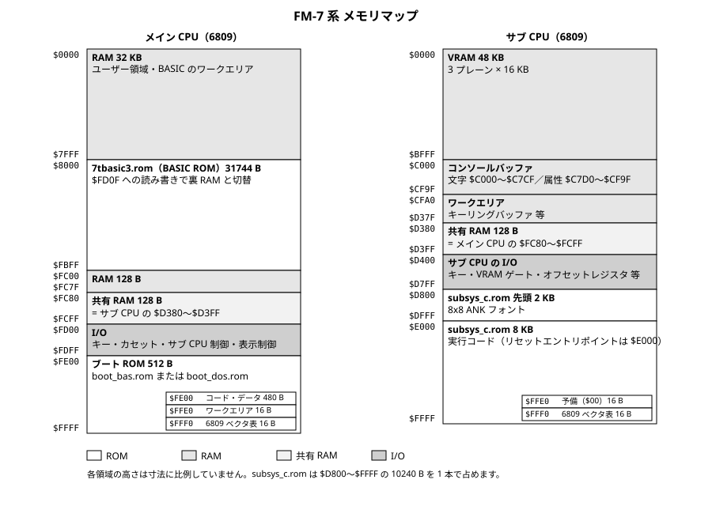
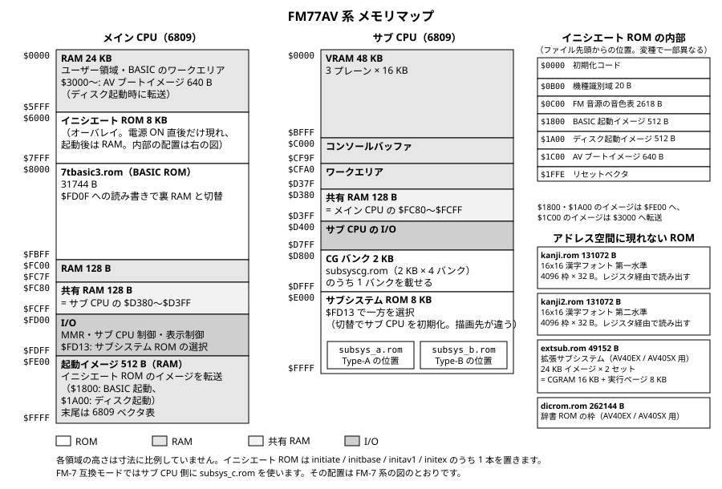

# BUILD — ビルド・ソースの構成・設計・テスト

ソースから ROM 15 本をビルドして同梱の `roms/` と一致することを確かめる手順（§1〜§3）、ソースとスクリプトの構成（§4）、ROM の設計（§5）、同梱しているテストプログラムの走らせ方（§6）です。Windows（WSL2）、macOS、Linux のどれでも同じ結果になります。

## 1. 開発環境を整える

| OS | 下準備 |
| --- | --- |
| Windows | WSL2 + Ubuntu を導入し、以降は WSL の Ubuntu シェルで作業します |
| Linux | そのままターミナルで作業します |
| macOS | Xcode Command Line Tools と Homebrew を用意します。`brew install coreutils` で `sha256sum` を、`brew install make` で GNU make を入れます。`gsha256sum` / `gmake` の名で入るので、`PATH` に `$(brew --prefix coreutils)/libexec/gnubin` と `$(brew --prefix make)/libexec/gnubin` を加えるか、以降の `make` / `sha256sum` をその名前に読み替えます |

| ツール | 必要なバージョン | 役割 |
| --- | --- | --- |
| 6809 アセンブラ（lwasm） | 4.23 以降 | 代替 ROM ソースのアセンブル |
| Python 3 | 3.7 以上 | フォント生成・予約語表の整合検査等のビルド補助 |
| GNU make | 3.81 以降 | ビルド全体の駆動（`$(wildcard)`・order-only 前提条件など GNU 拡張を使います） |
| GNU coreutils | — | `sha256sum` / `head` / `stat` |
| diffutils | — | `cmp`（クリーンビルド産物と同梱 `roms/` のバイト一致検査） |

6809 アセンブラには [lwtools](https://www.lwtools.ca/) の `lwasm` を使います。4.23 より前のバージョンでもビルドできますが、生成物が同梱の `roms/` と一致しないことがあります。

| OS | 導入例 |
| --- | --- |
| macOS | `brew install lwtools` |
| Linux（Debian/Ubuntu）／ Windows（WSL2） | 公式配布物からソースビルドします（下記） |

```bash
curl -LO https://www.lwtools.ca/releases/lwtools/lwtools-4.24.tar.gz
tar xzf lwtools-4.24.tar.gz
cd lwtools-4.24 && make && sudo make install
```

## 2. ビルド

```bash
cd <リポジトリ>
make
```

`build/` に配布 ROM 15 本（代替 ROM 12 本 + データ ROM 3 本）ができます。ツールチェイン名・出力先・ビルド対象は [config.mk](../config.mk) で設定します。ビルドにネットワーク接続は要らず、同じツールと同じ入力からは何度でも同じバイト列ができます。

### 2.1 make ターゲット

ふだん使うのは `make`・`make verify-release`・`make clean` の 3 つです。残りは個別の ROM のビルドと保守用です。

| コマンド | 動作 |
| --- | --- |
| `make` | 配布 ROM 15 種（代替 ROM 12 種 + データ ROM 3 種）をすべてビルドする |
| `make boot_bas` | boot_bas のみビルドする |
| `make boot_dos` | boot_dos のみビルドする |
| `make subsys_c` | subsys_c のみビルドする |
| `make initiate` | initiate のみビルドする（必要な中間生成物（`boot_init` / `avboot` 等）も生成する） |
| `make initbase` | initbase（initiate の機種別変種）のみビルドする |
| `make initav1` | initav1（initiate の機種別変種）のみビルドする |
| `make initex` | initex（initiate の機種別変種）のみビルドする |
| `make subsys_a` | subsys_a のみビルドする |
| `make subsys_b` | subsys_b のみビルドする |
| `make subsyscg` | subsyscg のみビルドする |
| `make extsub` | extsub のみビルドする（8x8 / 8x16 ANK フォントも生成） |
| `make 7tbasic3` | 7tbasic3（7T-BASIC 3.1）のみビルドする |
| `make kanji` | 16x16 漢字フォント ROM をビルドする（1 回の実行で `kanji.rom` と `kanji2.rom` の 2 本を書き出す） |
| `make kanji2` | 同上（`make kanji` と同じ生成を行う） |
| `make dicrom` | 辞書 ROM の枠（全域 `0x00`・262144 B）を生成する |
| `make verify` | 各 ROM をビルドし、生成物のサイズを検証する |
| `make verify-release` | クリーンビルド産物と同梱 `roms/` 15 本のバイト一致を検査し、`SHA256SUMS`、`fonts/SHA256SUMS`、およびサブシステム試験一式の BASIC ローダと `.s` の機械語の一致を照合する（`roms/` は書き換えない） |
| `make devtest-subsys` | [../src/devtest/subsys/cases/](../src/devtest/subsys/cases/) の `*.s` 全件を組み立て、追跡済み BASIC ローダの `DATA` 列がその機械語と一致することを照合する（ROM は作らない。`verify-release` から自動で呼ばれる） |
| `make verify-fonts` | `build/font.bin` / `build/font16.bin` のハッシュを [`fonts/SHA256SUMS`](../fonts/SHA256SUMS) と照合し、非ゼロ符号位置の集合を [LEGAL.md](LEGAL.md) §8.1 の 2 表と照合する（`verify-release` から自動で呼ばれる） |
| `make verify-kanji` | 同梱の入力 BDF とライセンス文のハッシュを [`fonts/SHA256SUMS`](../fonts/SHA256SUMS) と、`build/kanji.rom` / `build/kanji2.rom` のハッシュを [SHA256SUMS](../SHA256SUMS) と照合し、独自字形 107 符号位置の到達先の枠と内容を全数照合する（`verify-release` から自動で呼ばれる） |
| `make deploy-roms` | 保守用。全再ビルドののち `build/` の産物を `roms/` へ複写し、`SHA256SUMS` を作り直す（`make` の後に `bash scripts/copy_roms.sh` を実行しても同じ） |
| `make version` | 配布物のバージョン（`v1.0.2`）と 7T-BASIC のバージョン（`3.1`）を表示する |
| `make check-build-path` | 外部から与えた `BUILD` の値が削除してよいパスかを検査する（`make clean` から自動で呼ばれる） |
| `make check-build-guard` | 外部入力 `BUILD` の安全ガードを負例で検査する（ROM は作らない。検査の詳細は Makefile のコメントに記載） |
| `make clean` | `build/` をまるごと削除する |

予約語表の整合はスクリプトで検査します。7T-BASIC の予約語表・ジャンプ表・二次予約語表・トークン定数が、予約語の一覧と同じ並びで揃っているかを照合し、食い違いがあればその語を示して異常終了します。書き換えは行いません。

```bash
python3 scripts/gen_7t_keywords.py --check
```

### 2.2 生成物

| 生成物 | サイズ | 配置アドレス |
| --- | --- | --- |
| `build/boot_bas.rom` | 512 B | メイン CPU `$FE00-$FFFF` |
| `build/boot_dos.rom` | 512 B | メイン CPU `$FE00-$FFFF` |
| `build/subsys_c.rom` | 10240 B | サブ CPU `$D800-$FFFF`（先頭 2KB は ANK フォント） |
| `build/initiate.rom` | 8192 B | メイン CPU `$6000-$7FFF`（オーバレイ） |
| `build/initbase.rom` | 8192 B | メイン CPU `$6000-$7FFF`（オーバレイ。`initiate` の機種別変種） |
| `build/initav1.rom` | 8192 B | メイン CPU `$6000-$7FFF`（オーバレイ。`initiate` の機種別変種） |
| `build/initex.rom` | 8192 B | メイン CPU `$6000-$7FFF`（オーバレイ。`initiate` の機種別変種） |
| `build/subsys_a.rom` | 8192 B | サブ CPU `$E000-$FFFF` |
| `build/subsys_b.rom` | 8192 B | サブ CPU `$E000-$FFFF` |
| `build/subsyscg.rom` | 8192 B | CG バンク領域（2KB フォント × 4 バンク） |
| `build/extsub.rom` | 49152 B | 拡張サブシステム領域（24KB イメージ × 2 セット） |
| `build/7tbasic3.rom` | 31744 B | メイン CPU `$8000-$FBFF` |
| `build/kanji.rom` | 131072 B | 漢字 ROM 領域（第一水準。4096 枠 × 32 B） |
| `build/kanji2.rom` | 131072 B | 漢字 ROM 領域（第二水準。4096 枠 × 32 B） |
| `build/dicrom.rom` | 262144 B | 辞書 ROM 領域（所定サイズを供給する枠） |

- `build/boot_init.rom`（512 B）は initiate に取り込む中間生成物で、`make initiate` の過程で自動生成されます。単独では配布しません。`build/` の中間生成物は `.gitignore` 済みです。
- ANK フォントは `scripts/genfont.py`（8x8、`build/font.bin`）と `scripts/genfont16.py`（8x16、`build/font16.bin`）が生成し、`subsys_c` / `subsyscg` / `extsub` へ組み込みます（収録内容は [LEGAL.md](LEGAL.md) §8）。

| データ ROM | 生成スクリプト | 入力 |
| --- | --- | --- |
| `build/kanji.rom` / `build/kanji2.rom` | [`scripts/genkanji.py`](../scripts/genkanji.py) | [`fonts/shinonome/shnmk16.bdf`](../fonts/shinonome/shnmk16.bdf)（同梱の第三者フォントを改変した BDF。[../LICENSE-FONT.md](../LICENSE-FONT.md)）と [`scripts/kanji_glyph_overrides.py`](../scripts/kanji_glyph_overrides.py)（独自字形 107 符号位置） |
| `build/dicrom.rom` | [`scripts/gendicrom.py`](../scripts/gendicrom.py) | なし（全域 `0x00` を計算で作ります） |

## 3. ビルドの検査

```bash
make verify-release     # クリーンビルド産物と roms/ 15 本のバイト一致 + 下の照合まで
sha256sum -c SHA256SUMS # ハッシュだけを確かめる場合
```

`make verify-release` は `roms/` を書き換えずに、1 コマンドで次を照合します。

- クリーンビルドの産物と、チェックイン済み `roms/` 15 本のバイト一致
- 同梱 [SHA256SUMS](../SHA256SUMS) との突き合わせ（`sha256sum -c`）
- ANK フォント生成物のハッシュと収録範囲（`make verify-fonts`）
- 同梱の入力 BDF・16x16 漢字フォント ROM のハッシュと、独自字形 107 符号位置の到達先（`make verify-kanji`）
- サブシステム試験一式の BASIC ローダが `.s` の機械語と一致すること（`make devtest-subsys`）

データ ROM 3 本は BASIC プログラムでは確かめられないので、組み上げ時に機械検査します。

| 検査 | 実行方法 | 見ているもの |
| --- | --- | --- |
| 生成サイズ | `make verify` | 131072 B / 131072 B / 262144 B であること |
| 入力フォントと生成物のハッシュ | `make verify-kanji` | 同梱の入力 BDF が [`fonts/SHA256SUMS`](../fonts/SHA256SUMS)、`build/kanji.rom` / `build/kanji2.rom` が [SHA256SUMS](../SHA256SUMS) の記載どおりであること |
| 配置規則の健全性 | `make kanji`（生成のたびに自動） | 区点コードに対応する枠番号が 4096 枠内で重複しないこと、枠番号が ROM の枠数を超えないこと、書き込んだ字形が規則どおりの枠から全数で読み戻せること |
| 独自字形の到達 | `make verify-kanji` | 独自字形 107 符号位置のうち枠へ到達する 76 符号位置について、枠の 32 バイトが差し替え字形表と一致すること |
| 辞書 ROM の充填 | `make dicrom`（生成のたびに自動） | 全域が `0x00` であること |

検査はすべて手元のツールチェインだけで完結します。

### 3.1 同梱 BDF の再現手順

[../LICENSE-FONT.md](../LICENSE-FONT.md) の取得元 URL から配布物を取得して展開し、展開先で `sha256sum -c <リポジトリ>/fonts/shinonome/UPSTREAM_SHA256SUMS` を実行して照合します。入力 BDF とライセンス文のハッシュは [`fonts/SHA256SUMS`](../fonts/SHA256SUMS)、生成 ROM のハッシュは [`SHA256SUMS`](../SHA256SUMS) にあります。次に、リポジトリ直下で、その `bdf/shnmk16.bdf` を入力に `scripts/strip_bdf_chars.py` を実行します。`<配布物>` は展開先のパスに置きかえます。

```bash
# 同梱の BDF を作り直す
python3 scripts/strip_bdf_chars.py <配布物>/bdf/shnmk16.bdf \
    --out fonts/shinonome/shnmk16.bdf

# 同梱の BDF が上のツールの出力と一致することだけを確かめる
python3 scripts/strip_bdf_chars.py <配布物>/bdf/shnmk16.bdf \
    --check fonts/shinonome/shnmk16.bdf
```

## 4. ソースとスクリプトの構成

### 4.1 src/ — 代替 ROM のソース

代替 ROM 12 種の 6809 アセンブラソースと、テスト用の BASIC プログラムを置いています。すべて MIT ライセンスです。

| サブフォルダ | 対象機 | 内容 |
| --- | --- | --- |
| `boot_bas/` | FM-7 系 | BASIC モード起動ブート ROM のソース（`boot.s`） |
| `boot_dos/` | FM-7 系 | ディスク起動ブート ROM のソース（`boot.s`） |
| `subsys_c/` | FM-7 系／FM77AV 系（FM-7 互換モード） | サブシステム ROM のソース（`subsys.s`） |
| `initiate/` | FM77AV 系 | メイン CPU イニシエート ROM のソース（`initiate.s`） |
| `initbase/` | FM77AV20 系 | イニシエート ROM の機種別変種のソース（`initbase.s`。`initiate.s` を条件アセンブル） |
| `initav1/` | FM77AV 基本機（第 1 世代） | イニシエート ROM の機種別変種のソース（`initav1.s`。`initiate.s` を条件アセンブル） |
| `initex/` | FM77AV20EX / AV40EX / AV40SX | イニシエート ROM の機種別変種のソース（`initex.s`。`initiate.s` を条件アセンブル） |
| `boot_init/` | FM77AV 系 | initiate に埋め込む resident boot イメージのソース（`boot.s`、中間生成物） |
| `subsys_a/` | FM77AV 系 | Type-A の位置に置くサブシステム ROM のソース（`subsys_a.s`。中身は subsys_c と共通） |
| `subsys_b/` | FM77AV 系 | Type-B の位置に置くサブシステム ROM のソース（`subsys_b.s`。コマンド処理の本体は subsys_a と共通だが、320×200／4096 色のアナログモードで描く） |
| `subsyscg/` | FM77AV 系 | CG（キャラクタジェネレータ）ROM のソース（`subsyscg.s`） |
| `extsub/` | FM77AV40EX / AV40SX | 拡張サブシステム ROM のソース（`extsub.s`。フォント部のみ） |
| `7tbasic3/` | FM-7 / FM77AV 系 | BASIC インタプリタ本体 7tbasic3（7T-BASIC 3.1）のソース一式（`7t31/` と `common/`） |
| `devtest/` | — | テスト用に作成した BASIC プログラムと期待値、サブシステム ROM の 6809 サンプル試験（`subsys/`）。§6 |

データ ROM 3 種（`kanji.rom` / `kanji2.rom` / `dicrom.rom`）にアセンブリのソースはありません。[`scripts/genkanji.py`](../scripts/genkanji.py) と [`scripts/gendicrom.py`](../scripts/gendicrom.py) が同梱の入力データ（[`fonts/`](../fonts/)）から生成します（[LEGAL.md](LEGAL.md) §9）。

### 4.2 各 ROM のソース

**boot_bas / boot_dos** — 電源 ON 直後に BASIC モードでの起動（`boot_bas`）とディスク起動（`boot_dos`）を担う 512 B のブート ROM です。

- 先頭の固定エントリポイント `$FE02` / `$FE05` / `$FE08` でディスク BIOS（トラック 0 への復帰・セクタ書込み・セクタ読出し）を提供します（§5.2）。
- `boot_bas` は、BREAK キーでホットスタート、ディスクが無ければコールドスタートし、ドライブ 0 のトラック 0 セクタ 1 を `$0100` へ読んで実行します。5 回失敗するとコールドスタートします。
- `boot_dos` はドライブ 0 のトラック 0 のセクタ 1 を `$0300` へ、セクタ 2 を `$0400` へ読んで `$0300` へ渡し、読めなければブザーを鳴らして止まります。`$0300` を使うのはこの FM-7 系のディスク起動 ROM だけで、FM77AV 系は起動モードに依らず `$0100` です（§5.5）。
- ソース本体はそれぞれの `boot.s`（6809 アセンブラ）。生成物は `build/boot_bas.rom` / `build/boot_dos.rom`（各 512 B）。

**boot_init** — FM77AV 系のディスク起動時に `$FE00-$FFFF` に常駐する resident boot イメージのソースです。ディスク BIOS（トラック 0 への復帰・セクタ書込み・セクタ読出し）を提供します。固定エントリポイントは先頭の `$FE02` / `$FE05` / `$FE08` です（§5.2）。ドライブ 0 のトラック 0 セクタ 1 を `$0100` へ読み、`Y` = `$0500`・DP = 0 で `$0100` へ渡します。

- サイズは 512 B で、単独では配布しません。イニシエート ROM へ `INCLUDEBIN` で取り込む中間生成物です。
- ソース本体は `boot.s`。生成物は `build/boot_init.rom`。

**initiate（と initbase / initav1 / initex）** — FM77AV 系のメイン CPU 側で、電源 ON / リセット直後に最初に実行されるイニシエート ROM のソースです。サウンド・アナログパレット・メモリマッピングレジスタ（MMR）を初期化し、機種ごとの制御レジスタを起動時に設定して、BASIC 起動かディスク起動かを判定して制御を移します。ディスク起動の対象ドライブは機種世代で異なります（[SETUP.md](SETUP.md) §2.5）。

- サイズは 8192 B で、メイン CPU の `$6000-$7FFF` にオーバレイされます。イメージ内の配置は §5.5 にあります。
- ソース本体は `initiate.s`。機種別変種 `initbase` / `initav1` / `initex` は同じソースの条件アセンブルです。

`initiate.s` が `INCLUDEBIN` で取り込む中間生成物:

| 中間生成物 | ソース | 役割 |
| --- | --- | --- |
| `build/boot_bas.rom`（512 B） | `src/boot_bas/boot.s` | BASIC モード起動時に `$FE00-$FFFF` へ載るブートイメージ |
| `build/boot_init.rom`（512 B） | `src/boot_init/boot.s` | ディスク起動時に FDC サービスを供給する resident boot イメージ |
| `build/avboot.bin`（640 B） | `src/initiate/avboot.s` | 起動モード判定・メディア存在確認を行う AV ブートイメージ |

第 1 世代向けの `initav1` は AV ブートイメージを持ちません。`initbase` / `initex` は `initiate` と同じ 3 つを取り込みます。

**subsys_c** — FM-7 系のサブ CPU 側で、表示・キー入力・図形描画を受け持つサブシステム ROM のソースです。メイン CPU とは共有 RAM のコマンド域を介してやり取りします。

- サイズは 10240 B です。先頭 2KB（`$D800-$DFFF`）には 8x8 ANK フォント（`build/font.bin`。[LEGAL.md](LEGAL.md) §8）を `INCLUDEBIN` で組み込みます。
- エラーは番号で応答し、メッセージ文字列は持ちません。
- ソース本体は `subsys.s`。生成物は `build/subsys_c.rom`。

**subsys_a** — FM77AV 系のサブ CPU 側で動く、Type-A の位置に置くサブシステム ROM のソースです。メイン CPU からのサブシステムコマンド（画面初期化・文字表示・コンソール制御・キー入力・図形描画・タイマ）を共有 RAM 経由で受け取って実行します。コマンドの集合は FM-7 系の subsys_c と同じで、コマンド処理の実体は subsys_c と同じソースを AV 向け条件でアセンブルしたものです。

- サイズは 8192 B で、サブ CPU の `$E000-$FFFF` にマップされます。`$FD13`（Type 選択レジスタ）が 1 のときに選ばれます。
- ソース本体は `subsys_a.s`。生成物は `build/subsys_a.rom`。

**subsys_b** — FM77AV 系のサブ CPU 側で動く、Type-B の位置に置くサブシステム ROM のソースです。コマンド処理の本体は subsys_a と共通のソースを Type-B 向け条件でアセンブルしたものですが、画面は 320×200／4096 色のアナログモード（1 画素の色を B・R・G 各 4 ビットで扱う 12 面）で描き、色の指定形式が異なるコマンドがあります（[COMPATIBILITY.md](COMPATIBILITY.md) §1.1）。`$FD13` が 2 のときに選ばれます。

- サイズは 8192 B で、サブ CPU の `$E000-$FFFF` にマップされます。上記のとおり描画先が異なるため、生成物は `build/subsys_a.rom` とバイト列が異なります。
- ソース本体は `subsys_b.s`。生成物は `build/subsys_b.rom`。

**subsyscg** — FM77AV 系のサブ CPU 側の CG バンク領域に載せる 8x8 ANK フォント ROM のソースです。コードを持たず、リセットベクタもありません。

- サイズは 8192 B で、2KB のフォントを 4 バンク分に置きます。フォントは FM-7 系の `subsys_c` と同じ `build/font.bin` です。
- ソース本体は `subsyscg.s`。生成物は `build/subsyscg.rom`。

**extsub** — FM77AV40EX / AV40SX の拡張サブシステム ROM のソースです。フォント部（8x8 と 8x16 の ANK フォント）だけを持ち、イメージ内の配置は §5.6 のとおりです。ソース本体は `extsub.s`。生成物は `build/extsub.rom`（49152 B）。

**7tbasic3** — BASIC インタプリタ本体 7T-BASIC 3.1 のソース一式です。`7t31/` に本体、`common/` に予約語表・ジャンプ表・トークン定数（`scripts/gen_7t_keywords.py` が生成・照合）を置きます。生成物は `build/7tbasic3.rom`（31744 B）。

### 4.3 scripts/ — ビルド補助スクリプト

`make` から呼び出すビルド補助スクリプトと、ビルド済み ROM を `roms/` へ集めるスクリプトです。すべて MIT ライセンスです。

| スクリプト | 役割 |
| --- | --- |
| `gen_7t_keywords.py` | 7T-BASIC の予約語表・ジャンプ表・二次予約語表・トークン定数を、予約語の一覧から同じ並びで生成します。`--check` を付けると書き換えずに照合だけを行い、一覧と `src/7tbasic3/common/` の各表が食い違うと異常終了します |
| `gen_subsys_tests.py` | `src/devtest/subsys/cases/*.s` 129 件を組み立て、追跡済み BASIC ローダの `DATA` 列と一致するか照合します（`make devtest-subsys`）。`--write` で追跡済みローダを更新します |
| `genfont.py` | 8x8 ANK フォント生成（`build/font.bin`、2048 バイト）。字形は本プロジェクトの独自設計で、実体はこのスクリプトにあります（[LEGAL.md](LEGAL.md) §8）。`make` から自動で呼ばれます |
| `genfont16.py` | 8x16 ANK フォント生成（`build/font16.bin`、4096 バイト）。`build/font.bin` を縦 2 倍にして生成します。`make` から自動で呼ばれます |
| `check_font_repertoire.py` | 生成済み ANK フォントの字形のある符号位置を、[LEGAL.md](LEGAL.md) §8.1 の 2 表と機械照合します（`make verify-fonts` から自動で呼ばれます） |
| `genkanji.py` | 16x16 漢字フォント ROM 生成（`build/kanji.rom` / `build/kanji2.rom`、各 131072 バイト）。同梱の BDF（[../fonts/shinonome/](../fonts/shinonome/)）の字形を、本プロジェクトの配置規則で枠へ並べ替えます。JIS 1〜8 区の 107 符号位置には `kanji_glyph_overrides.py` の独自字形を用います。1 回の実行で 2 本を書き出します（`make kanji`） |
| `kanji_glyph_overrides.py` | 16x16 漢字フォントの差し替え字形表。JIS 1〜8 区の 107 符号位置について、本プロジェクトが書き起こした字形を定義します（一覧は [LEGAL.md](LEGAL.md) §9.2）。単体で実行すると全 107 字を一覧表示します |
| `check_kanji_overrides.py` | 独自字形 107 符号位置が生成 ROM の意図した枠へ行き渡っていること、および同梱 BDF が当該 107 符号位置の字形を持たない改変済みのものであることを照合します（`make verify-kanji` から自動で呼ばれます） |
| `strip_bdf_chars.py` | 同梱する入力 BDF の改変ツール。配布物の BDF から JIS 1〜8 区の 107 符号位置の `CHAR` レコードを取り除きます。リポジトリには改変済みの BDF だけを置くので `make` からは呼びません（手順は §3.1） |
| `gendicrom.py` | 辞書 ROM の枠の生成（`build/dicrom.rom`、全域 `0x00`・262144 バイト）。かな漢字変換は未対応です（`make dicrom`） |
| `copy_roms.sh` | ビルド済みの配布 ROM 15 本（`build/*.rom`）を `roms/` へコピーし、サイズとバイト一致を検査したうえで `SHA256SUMS` を再生成します（`make deploy-roms`） |

## 5. ROM の設計

本プロジェクトの代替 ROM は、参考書籍（書誌は [LEGAL.md](LEGAL.md) §6.1）を基に実装しています。ROM を配置するメモリアドレスは、参考書籍に記載のものに沿っています。他のソフトウェアがアドレスを直接呼ぶ固定エントリポイントと、当方の ROM 同士だけで用いる取り決めは §5.2、FM77AV 系サブシステムのコマンド番号と ROM イメージ内の配置は §5.4〜§5.6 にあります。FM-7 系と FM77AV 系の 2 系統があり、各 ROM が何をするかは [SETUP.md](SETUP.md) §2 にあります。

### 5.1 メモリマップ

**FM-7 系**



**FM77AV 系**



### 5.2 固定エントリポイントと当方の ROM 同士の取り決め

外部から呼ぶエントリポイントは、下表の固定アドレスに置きます。下表の固定エントリポイントに加え、当方の起動 ROM と BASIC ROM の間で用いる識別語とベクタ 2 つがあります。

| アドレス | 名前 | 置く ROM | 読む／呼ぶ ROM | 役割 |
| --- | --- | --- | --- | --- |
| `$FBFA` | 固定エントリポイント | `7tbasic3` | 他のソフトウェア | 入出力サービスのエントリポイントを指す間接ベクタ。`JSR [$FBFA]` で呼び、要求は 8 バイトの制御ブロックに置いて先頭アドレスを `X` で渡します |
| `$FBFC` / `$FBFE` | 固定エントリポイント | `7tbasic3` | ディスクのローダ | 起動の間接ベクタ。`JMP [$FBFE]` で BASIC を起動します。7T-BASIC はどちらもコールドスタートを指し、`A` と `X` によらず ROM モードで起動します |
| `$FE02` / `$FE05` / `$FE08` | 固定エントリポイント | `boot_bas` / `boot_dos` / `boot_init` | 他のソフトウェア、`7tbasic3`（BIOS のリクエスト 8〜10）、AV 起動用イメージ | ディスク BIOS の処理アドレス（`$FE02` = RESTOR、`$FE05` = DWRITE、`$FE08` = DREAD）。呼出しは、要求を 8 バイトの制御ブロック（+0 リクエスト番号 8 / 9 / 10、+2〜3 データバッファ、+4 トラック、+5 セクタ、+6 サイド、+7 ドライブ）に置いて先頭アドレスを `X` で渡し、DP = `$FD` で呼びます。戻りは +1 にエラー番号（0 = 正常。10〜15 はディスクのエラー）、エラーのときキャリー = 1 です。位置決めの前にドライブごとのヘッドのトラックの控え（`$FFE1`＋ドライブ）をトラックレジスタへ書き戻し、位置決めの誤りはセクタの ID の照合の結果（12）として返します |
| `$DAEF` / `$DAF6` / `$DAF9` | 固定エントリポイント | `7tbasic3` | 他のソフトウェア | カーソル消去・表示・画面機能設定 |
| `$FF5E` | 固定エントリポイント | `boot_bas` / `boot_init` | 他のソフトウェア | ディスク BIOS のもう 1 つの入口。制御ブロックの先頭アドレスを `X` で渡し、+0 のリクエスト番号（8 / 9 / 10）に従って処理します |
| `$FBF4` | `BASVEC_SIG` | `7tbasic3` | `boot_bas` / AV 起動用イメージ | 識別用の 2 バイト `"7T"`。一致したときだけ下の 2 つのベクタを読みます。一致しないときは、参考書籍に載る BASIC の入口へ移ります |
| `$FBF6` | `BASVEC_COLD` | `7tbasic3` | `boot_bas` / AV 起動用イメージ | コールドスタートのエントリポイントを指すベクタ |
| `$FBF8` | `BASVEC_SECOND` | `7tbasic3` | `boot_bas` / AV 起動用イメージ | ディスク起動が成立しなかったときの入口を指すベクタ（中身はコールドスタートと同じ） |

外部のプログラムが直接参照するアドレスは次の 3 とおりです（[COMPATIBILITY.md](COMPATIBILITY.md) §3.1）。(1) ディスク BIOS の処理アドレス（`$FE02`／`$FE05`／`$FE08`）を `JSR` で直接呼ぶもの、(2) カーソルと画面機能の入口（`$DAEF`／`$DAF6`／`$DAF9`）を直接呼ぶもの、(3) BASIC のワークエリアを `PEEK`／`POKE` や機械語から読み書きするもの。

### 5.3 BASIC プログラムの格納方式

7T-BASIC は、打ち込んだプログラムを ASCII のテキストとして、行番号順の行リンクリストでメモリに持ちます。予約語の省略形（`C.` など）は入力時に完全形へ展開します。それ以外の綴り・空白・大小文字は保持し、`LIST` は格納したテキストを表示します。引用符・`REM`・`DATA` の中は省略形を展開しません。実行時には到達した行をその都度解釈します。`SAVE` / `LOAD` / `MERGE` の保存形式はアスキー形式（ファイル形式 `00` = BASIC ソース、属性 `$FF` = アスキー。本文は `LIST` と同じ行番号つきテキスト）です。中間コード（バイナリ）形式で保存されたファイルは読めません（[COMPATIBILITY.md](COMPATIBILITY.md) §3.2）。

カセットへ書くブロックの並びは、ギャップの `$FF`、識別子 `$01` `$3C`、ブロック種別、長さ、データ、検査和、ブロックの後のエンドギャップ `$FF` × 4 です。ヘッダブロックは 20 バイトです。ギャップはモータを回し始めた直後のヘッダブロックだけ `$FF` × 255、続くデータブロックとエンドブロックは `$FF` × 10 です。ディスクは 2D 書式で、ID セクタ（トラック 0・セクタ 3）・FAT（トラック 1・セクタ 1 の 6 バイト目から 152 クラスタ分）・ディレクトリ（トラック 1・セクタ 4 から 32 までの 232 スロット。1 スロット 32 バイトで、+11 ファイルタイプ、+12 アスキーフラグ、+13 ランダムアクセスフラグ、+14 先頭クラスタ番号）・1 クラスタ 8 セクタで構成します。

### 5.4 FM77AV 系サブシステムのコマンド

`subsys_a`（Type-A の位置）と `subsys_b`（Type-B の位置）は、FM-7 系の `subsys_c` が応答するコマンドに加えて、FM77AV の `$22`（表示ページ・処理ページの選択）・`$39`（枠付きの矩形の塗り）・`$45`（キーエンコーダ命令）・`$7F`（共有 RAM の相対 3 からの処理の実行）に応答します（一覧は §6.2。各 ROM の役割は [SETUP.md](SETUP.md) §2.4）。`subsys_b` は `$1B` を受け付けません。一覧に無いコマンドコード（Type-A の `$24`、Type-B の `$14` 等）は受理し、エラーコード `$46` を返して何もしません。

### 5.5 イニシエート ROM のイメージ構成

`initiate` / `initbase` / `initav1` / `initex` は同じ枠の機種別変種です（違いと使う機種は [SETUP.md](SETUP.md) §2.5）。位置はファイル先頭からのオフセットです。

| 位置 | 内容 | 備える変種 |
| --- | --- | --- |
| `$0B00` | 機種識別域（20 B。下表） | 4 本すべて |
| `$0C00` | FM 音源の音色表（2618 B。34 B × 77、音色番号 0〜76。1 音色は音源のレジスタへ送る 25 B（DT/MUL × 4、TL × 4、KS/AR × 4、AM/DR × 4、SR × 4、SL/RR × 4、FB/ALG）と、9 B（本プロジェクトの表では 0）です） | 4 本すべて |
| `$1800` | BASIC 起動イメージ（512 B。`boot_bas` と同じ内容。転送先 `$FE00`） | 4 本すべて |
| `$1A00` | ディスク起動イメージ（512 B。`boot_init` の resident boot。転送先 `$FE00`。トラック 0 のセクタ 1 を `$0100` へ読んで `$0100` へ渡し、読めなければブザーを鳴らして止まります） | 4 本すべて |
| `$1C00` | AV ブートイメージ（640 B。転送先 `$3000`。ドライブ 1〜3 から起動するときは、トラック 0 のセクタ 2 以降も `$0200` 以降へ先読みしてから `$0100` へ渡します。起動できる媒体が無いときは、BASIC モードでは BASIC へ移り、ディスクモードではブザーを鳴らして止まります） | `initiate` / `initbase` / `initex` |

`initav1` は AV ブートイメージを持たず、起動用イメージを resident boot 領域（`$FE00`）へ複写してその場で実行します。

機種識別域は、ソフトウェアが利用できる画面モードを判定するために読む 20 バイトで、内容は本プロジェクト独自です。

| 位置 | 長さ | 内容 |
| --- | ---: | --- |
| `$0B00` | 6 B | 識別子 `ALTROM` |
| `$0B06` | 3 B | イニシエート ROM のバージョン `110`（`1.10`） |
| `$0B09` | 5 B | 世代表示 |
| `$0B0E` | 2 B | 機種区分（持たない世代は `$FF`） |
| `$0B10` | 1 B | 拡張世代の識別値（`initex` は `'1'`、他は `$00`。機種区分を持たない世代は `$FF`） |
| `$0B11` | 3 B | 予備（`$00`。機種区分を持たない世代は `$FF`） |

| 変種 | 世代表示 | 機種区分 |
| --- | --- | --- |
| `initiate` | `"AV040"` | `"40"` |
| `initbase` | `"AV020"` | `"20"` |
| `initav1` | `"AV001"` | なし（`$FF` × 6） |
| `initex` | `"AV4EX"` | `"40"` |

### 5.6 拡張サブシステム ROM のイメージ構成

`extsub`（49152 B。役割は [SETUP.md](SETUP.md) §2.6）は 24KB のイメージ 2 セットからなり、各セットは CGRAM 用 16KB（2KB × 8 バンク）と実行ページ用 8KB です。収録しているのはフォント部だけで、実行ページに相当する領域はゼロ埋めです。

| 領域 | 内容 |
| --- | --- |
| `$0000-$0FFF` | 8x16 ANK フォント 256 字（1 文字 16 B） |
| `$1000-$17FF` | 8x8 ANK フォント 256 字（1 文字 8 B） |
| `$6000-$67FF` | 8x8 ANK フォント 256 字 |
| `$6800-$6FFF` | 8x8 ANK フォント 256 字（別書体枠。同一字形） |
| 上記以外 | 予約・実行ページ相当（ゼロ埋め） |

フォントは他の ROM と同じ 8x8 ANK 字形で、8x16 は 8x8 の各走査線を縦に 2 回ずつ複製したものです（[LEGAL.md](LEGAL.md) §8）。

## 6. テスト

同梱しているテストプログラムを手元の実行環境で走らせ、期待値と照合する手順です。テストを自動で走らせる仕組みはありません。ケースを 1 本ずつ実行環境で `RUN` して出力を期待値ファイルと照合するか、お手元の仕組みで一括して走らせます。テストは 2 系統あります。

| 系統 | 置き場所 | 件数 | 何を確かめるか |
| --- | --- | ---: | --- |
| BASIC の言語仕様（§6.1） | [../src/devtest/cases/](../src/devtest/cases/) | `src/devtest/cases/` に 145 本 | [BASIC_REFERENCE.md](BASIC_REFERENCE.md) が「サポートする」と記載する予約語（コマンド・ステートメント・関数・演算子・特殊変数）の動作 |
| サブシステム ROM の機能（§6.2） | [../src/devtest/subsys/cases/](../src/devtest/subsys/cases/) | `src/devtest/subsys/cases/` に 129 件 | サブ CPU の ROM（`subsys_c` / `subsys_a` / `subsys_b`）が受け付けるコマンドを 1 件ずつ発行し、応答と画面を観測する |

入力（`.bas` / `.s` / `.stdin`）と期待値はそのまま公開しています。実行環境は自由に選べます。画面や音源レジスタの読み取りは実行環境の機能に頼るので、その手段はこの文書では定めません。読み取れない環境では、画面と音を目視と耳で確かめます。カセットテープやディスクへの読み書きを伴うコマンドとディスク起動は、結果が媒体と装置の状態に左右されるので、この 2 系統には含めず手で確かめます（§6.3）。`src/devtest/` の内容（`.bas`・`.s`・期待値ファイル）は MIT License（[../LICENSE](../LICENSE)）です。

### 6.1 BASIC の言語仕様のテスト

`src/devtest/cases/<ID>.bas` が BASIC の言語仕様を確かめるテストプログラムで、期待値は、出力が一意に決まるものだけを収録しています。

| パス | 内容 |
| --- | --- |
| `cases/*.bas` | テストプログラム本体（本プロジェクトがテスト用に作成） |
| `cases/*.expected` | 文字出力のバイト一致照合用の期待値（F-BASIC 標準書式） |
| `cases/*.expected_screen` | 画面照合用の期待値（実行後の画面の色番号列のダイジェストと縮図） |
| `cases/*.expected_sound` | 出音照合用の期待値（音の周期・音量・継続の列） |
| `cases/*.stdin` | 実行中に打鍵として与える入力 |

#### 区分とねらい

| 区分 | ファイル名の接頭辞 | ねらい |
| --- | --- | --- |
| eval | `eval_*` | 式評価（算術・論理・比較演算子の優先順位と結果、基数付き定数の値域と型） |
| ctrl | `ctrl_*` / `cont_*` | 制御構造（FOR/NEXT、IF/THEN/ELSE、GOSUB/RETURN、ON GOTO/GOSUB、WHILE/WEND、STOP/CONT） |
| cmd | `cmd_*` / `list_*` | コマンド（RUN 行番号、LIST の範囲、SAVE の非対応形式の扱い） |
| str | `str_*` | 文字列関数（LEN/LEFT$/RIGHT$/MID$/連結/INSTR/HEX$ 等） |
| math | `math_*` / `rnd_*` / `num_*` | 数値関数（丸め系・初等関数）、乱数の性質、数値定数と表示形式 |
| data | `data_*` / `datnum_*` / `datsep_*` | DATA/READ/RESTORE と配列、DATA の値の切れ方 |
| edit | `edit_*` / `inpcol_*` / `inpredo_*` / `linp_*` / `inkey_*` | 対話モードの行編集と、INPUT / LINE INPUT / INKEY$ の行・キーの受け取り |
| type | `fntype_*` | 実引数の型検査（数値・文字列を取り違えたときの `Type Mismatch`） |
| var | `var_*` | 変数（型サフィックスの区別、予約語を含む名前、名前の有意長、DEFINT 等） |
| using | `using_*` / `using_e*` | PRINT USING の数値・文字列書式（指数形式 `^^^^` を含む） |
| print | `print_*` | PRINT の区切り（`;` `,` TAB SPC）と折返し、省略形 `?` |
| err | `err_*` / `resume_*` | 実行時エラーの表示書式とエラーコード、ERR/ERL、RESUME の再開位置 |
| fn | `fn_*` / `usr_*` / `erase_*` | DEF FN、DEF USR / USR / EXEC（機械語の呼び出し）、ERASE |
| scr | `locarg_*` / `locate_*` / `pos_*` / `key_*` / `cons_*` | 画面制御文の引数の文法（LOCATE）、カーソルを移した先の桁と行（LOCATE / POS）、KEY / KEY LIST、CONSOLE の機能キー行表示と単色表示 |
| sys | `sys_*` / `intv_*` / `time_*` | システム関数（PEEK/POKE、VARPTR、TIME$/DATE$）、INTERVAL 割込み、タイマ割込み |
| gfx | `gfx_*` / `circ_*` / `gcur_*` | 画面と配列の間の転送文（GET@/PUT@）、図形の引数と座標の丸め（POINT による読み取り）、GCURSOR の座標の読取り |
| gscr | `gscr_*` | **図形描画の画面照合**（PSET/PRESET/LINE/CIRCLE/PAINT/SYMBOL/GCURSOR/CONNECT/GET@・PUT@/COLOR/SCREEN/WIDTH/CONSOLE） |
| snd | `snd_*` / `play_*` / `beep_*` | **音楽ステートメントの出音照合**（PLAY の制御文字列、SOUND、BEEP） |
| neg | `neg_*` | 境界値・異常入力に対する挙動（あふれ・閉じない引用符・入れ子の限度 等） |

番号は連番ではなく、欠番（`var_06`・`eval_05`〜`eval_25`・`neg_01` 等）があります。

#### 期待値ファイルの読み方

各 `.bas` を、本 ROM を組み込んだ FM-7 / FM77AV 系のエミュレーターで `RUN` し、期待値ファイルの種類に応じて照合します。期待値は FM-7 と FM77AV 系のどの機種でも同じです。

1. **`<ID>.expected`（文字出力）** — 画面に出た文字列をバイト単位で照合します。期待値は F-BASIC の標準の出力書式（数値の前置スペース・桁揃え）に従っています。`Ready` を挟んで直接モードの打鍵が続くケース（`ctrl_08` / `cont_01` / `cmd_01` / `cmd_02` / `err_06`）では、途中の `Ready` や打鍵の反響も含めた画面の写しが期待値です。
2. **`<ID>.expected_screen`（画面照合。図形描画の試験）** — プログラムは描画を残すために無限ループで終わります。実行後の画面（横 640 × 縦 200 ドット、色番号 0〜7）を読み取り、その並び（128000 バイト）の SHA-256 が `digest:` 行と一致するかを照合します。`#p` 行は 8x8 ドットを 1 文字へ集約した縮図で、目で確かめるときはこの縮図と画面を見比べます。`hist:` 行は色番号ごとのドット数です。
3. **`<ID>.expected_sound`（出音照合。音楽ステートメントの試験）** — 実行環境の音源レジスタを 1 フレーム（1/60 秒）ごとに観測し、鳴った音の列を照合します。期待値ファイルの各行が 1 つの照合項目です。
   - `NOTE <声部 0-2> <周期> <音量|E|*> <継続フレーム数>` — その声部で次に鳴る音。周期は音源のトーン周期レジスタの値（12 ビット）、音量は音量レジスタの値（`E` はエンベロープ使用、`*` は任意）。継続は ±25% か ±4 フレームの大きい方を許容します。
   - `REST <声部> <継続フレーム数>` — 音の切れ目（休符）。
   - `END <声部> <個数>` — その声部で鳴った音の総数。
   - `CHORD <周期0> <周期1> <周期2>` — 3 声が同時にこの周期で鳴った瞬間があること。
   - `ENV <形状> <周期>` — エンベロープの形状・周期レジスタにこの組が現れたこと。
   - `REG <番号> <値>` — 観測終了時の音源レジスタの値。
   - `SILENT` — 観測終了時に全声部が無音であること。耳で確かめるときは、音名と長さの並び（ファイル先頭の注釈に記載）どおりに聞こえるかを確かめます。

期待値ファイルを持たないのは `eval_02` の 1 本だけで、書式と挙動を目視で確認します。

#### `.stdin` を持つケース

`edit_07` / `inpcol_01` / `inpredo_01` / `inpredo_02` / `inkey_01` / `linp_01` / `ctrl_08` / `cont_01` / `cmd_01` / `cmd_02` / `err_06` / `gcur_01` / `del_01` には `<ID>.stdin` を添えています。**そのプログラムを走らせている間（または実行後の直接モード）にキーボードから打ち込む文字列**です。

- 1 行が 1 回分の入力で、行末で `RETURN` を打つものとして読みます。ファイル末尾の改行も 1 回の `RETURN` です。`inkey_01` のように改行の無いファイルは、文字だけを打って `RETURN` を打ちません。
- **空行は「何も打たずに `RETURN` だけ」です。**
- **行の先頭・途中・末尾の空白は、そのまま打つ文字です。取り除かないでください。** `inpcol_01` の ` 12 : 34 ` は、`INPUT` が値をどこで切るかを確かめる材料です。
- `linp_01` の 4 行目の `A` と `B` の間は**桁送りキー**（TAB）です。
- 手で確かめる場合は、プログラムが入力待ちで止まったところで、`.stdin` の行を上から順に打ち込みます。自動で流す場合は、実行環境のキー入力へ同じ順序で送り込みます。

#### 期待値の作り方（テストを追加するとき）

- `.expected`（文字出力）— 出力されるべき文字列を F-BASIC の標準書式どおりに書き下ろし、実行結果とバイト単位で一致したときだけ確定します。出力が一意に定まらないケースは `.expected` を置かず、目視の対象にします。
- `.expected_screen`（画面照合）— 描かれるべき図形（位置・形・色・塗り）を書き出します。実行後の画面から作ったダイジェストと縮図がその図形と一致することを確かめてから確定します。一致しないときは `hist:` と縮図から、どの図形がどう違ったかをたどれます。
- `.expected_sound`（出音照合）— 鳴るべき音の列（音名 → 周期、長さ → フレーム数、音量・エンベロープ）を計算して書き下ろします。観測列との一致を確かめてから確定します。周期は音源クロックと音名の周波数から一意に決まります（例: O4A = 440Hz → 周期 175、T120 の四分音符 = 0.5 秒 = 30 フレーム）。

#### `neg_*`（境界値・異常入力）の期待値

`neg_*` は、値の範囲・長さ・入れ子の深さを意図的に外れさせたときの挙動を確かめる区分です。期待値に置くのは、**その入力が誤りとして捕まるか、捕まらずに通るか**と、**そのあと制御が戻り、続く文が普通に動くか**の 2 点だけです。

**限度そのものの値**（`GOSUB` を何段まで積めるか、確保できる配列の大きさなど）は使える資源の量で決まります。そこで `neg_06` のように、段数を印字せず `TRAP`（誤りとして捕まった）/ `PASS`（通った）/ `DEEP`（実際に積み上がった）という語だけを出します。

**誤り番号そのもの**は資源量に依存しないので期待値に置きます。入れ子の限度に達したときは `7`（Out Of Memory）です（`neg_16`）。

#### 収録の範囲

カセットテープ・ディスクへの読み書きを伴うコマンド（`LOAD` / `SAVE` / `LOADM` / `SAVEM` / `MERGE` / `FILES` / `CHAIN`、およびディスク起動）は、結果が媒体と装置の状態に左右されるので収録していません。装置に触れずに確かめられる範囲は収録しています（`SAVEM` / `CLEAR` のアドレス引数の受理 = `eval_27`、`SAVE` のオプションの受理 = `cmd_02`、`EXEC` = `usr_01`）。

#### テスト一覧

| ID | 検証する内容 |
| --- | --- |
| `abbr_01` | キーワードの省略形 16 語（入力の受理、LIST は完全形、引用符・REM・DATA の中は原文のまま） |
| `circ_01`〜`circ_04` | CIRCLE の開始・終了位置／塗りつぶし F・N／縦横比（POINT 読み取り） |
| `circ_05` | CIRCLE の機能（PSET / PRESET。塗りつぶしでも線に効く） |
| `cmd_01` | RUN 行番号（指定行から実行、変数はクリア） |
| `cmd_02` | SAVE のオプション（`A` / `P` 以外は Syntax Error） |
| `cons_mono_01` | 【画面】CONSOLE の単色表示（第 4 引数）。1 にすると COLOR の指定にかかわらず文字が緑のみになる |
| `cons_mono_02` | 【画面】第 4 引数を 0 に戻すと COLOR の色で表示される |
| `cons_pf_01` | 【画面】CONSOLE の機能キー行表示（第 3 引数）。画面の下 2 行に 1〜5 / 6〜10 が 5 欄で並び、スクロールに使える行が 2 行減る |
| `cons_pf_02` | 【画面】機能キー行の表示中に KEY で定義を変えると描き直される |
| `cons_pf_03` | 【画面】第 3 引数を 0 に戻すと機能キー行が消える |
| `cont_01` | 中断後の CLEAR で CONT が Can't Continue (17) |
| `csrlin_01` | CSRLIN／POS(0)／SCREEN(x,y)（LOCATE で移した先の読み取り、書いた文字列の逆順読み戻し） |
| `ctrl_01`〜`ctrl_04` | FOR/NEXT（負・小数 STEP、入れ子、NEXT の複数変数）、IF/THEN/ELSE、GOSUB 再帰 |
| `ctrl_05` `ctrl_05b` | ON GOTO（値 1〜n、0・範囲外は素通り） |
| `ctrl_06` | WHILE/WEND（基本・入れ子・入口で偽） |
| `ctrl_07` | ON GOSUB、GO TO / GO SUB / ON GO TO の分かち書き |
| `ctrl_08` | STOP の Break 表示、CONT の再開、中断中の直接モード代入 |
| `data_01`〜`data_04` | READ/DATA/RESTORE、配列（1 次元・2 次元）、DIM |
| `datnum_01` `datnum_02` | DATA の空の値・数として読めない綴りの扱いと発生行 |
| `datsep_01` | DATA の区切り（: と引用符） |
| `del_01` | UNLIST（指定行以降を LIST に出さない）と DELETE（指定行の削除）。実行後の直接モードで LIST を打って確かめる |
| `edit_01`〜`edit_07` | 行の置換・削除・挿入、長い行、CLEAR の文字列領域、INPUT の 1 行 |
| `erase_01` | ERASE（再 DIM、複数指定、不存在名、再 DIM なしは誤り 10） |
| `err_01` | エラー表示書式 `<エラー名> In <行番号>` |
| `err_02` | ERR/ERL、RESUME による ERR の復帰、RESUME 行番号 |
| `err_03` | 自然発生のエラーコード 1 / 3 / 4 / 8 / 11 / 18 / 25 / 20 |
| `err_04` | コード 67 のエラー名表示（`Disk Full In 20`） |
| `err_05` | 欠番コードの `Unprintable Error` |
| `err_06` | 直接モードのエラーは `In <行番号>` なし |
| `eval_01`〜`eval_04` | 演算子の優先順位、\ と MOD、論理・比較演算子、文字列比較 |
| `eval_02` | 整数の桁あふれ（目視） |
| `eval_26` `eval_27` | 基数付き定数 (&H/&O) の値域、アドレス引数への受理 |
| `eval_28` | 比較演算子 <= >=（数値・文字列） |
| `eval_29` | 論理演算子 IMP / EQV の真理値表、論理演算子どうしと \ MOD の優先順位 |
| `fn_01` | DEF FN（入れ子・再定義・複数使用・文字列関数・仮引数の保護） |
| `fre_01` | FRE（数値／文字列引数）と POS の性質 |
| `fntype_01`〜`fntype_03` | 関数実引数の型検査（Type Mismatch） |
| `gfx_01` `gfx_02` | GET@/PUT@ の 4 形式（図形・キャラクタ、POINT・配列で確認） |
| `gfx_03` | 座標の丸め（横 639 へ・縦 199 へ）、範囲外の誤り 5、小数座標の丸め |
| `gcur_01` | GCURSOR の座標の読取り（組 1 個・2 個＋パレットコード・配列の要素） |
| `gcur_02` | GCURSOR の組の個数（無し・11 個は誤り 2） |
| `gcur_03` | GCURSOR の第 2 引数に文字列式を書いた綴りは Syntax Error |
| `gscr_01` | 【画面】PSET / PRESET と色番号、既定色 |
| `gscr_02` | 【画面】LINE（始点省略・B・BF・PRESET） |
| `gscr_03` | 【画面】CIRCLE（真円・既定縦横比・楕円・円弧・扇形 F・N） |
| `gscr_04` | 【画面】PAINT（境界色の省略・複数指定） |
| `gscr_05` | 【画面】SYMBOL（倍率・色・角度）と GCURSOR |
| `gscr_06` | 【画面】CONNECT の多点指定 |
| `gscr_07` | 【画面】画面外座標の丸め（LINE・CIRCLE 中心・縦 199 へ）、小数座標 |
| `gscr_08` | 【画面】COLOR、COLOR=(パレット,カラー)、SCREEN の書き込み面・表示面 |
| `gscr_09` | 【画面】GET@/PUT@ 図形形式の PSET / OR / XOR / 3 面復元 |
| `gscr_10` | 【画面】WIDTH 80 の文字書式 |
| `gscr_11` | 【画面】CONSOLE のスクロール領域、COLOR の文字色、LOCATE の絶対行 |
| `gscr_12` | 【画面】COLOR=(パレット,カラー) のパレットコード 0（常に 0 が割り付けられ、地の色は黒のまま） |
| `inkey_01` | INKEY$（キー待ちと 1 文字の受け取り） |
| `inpcol_01` | INPUT の項目の切れ方（コンマ・引用符・空白） |
| `inpredo_01` `inpredo_02` | ?Redo From Start（やり直し）、INPUT はエラーにならない |
| `intv_01` | INTERVAL / ON INTERVAL GOSUB、引数の誤り（0 / なし / 2 個 / GOTO 形） |
| `key_01` | KEY の割り当て・消去・KEY LIST、KEY ON は Syntax Error |
| `linp_01` | LINE INPUT（引用符そのまま・TAB・空行・行末空白）、INPUT のプロンプト `,` |
| `list_01` `list_02` | LIST（カナの保持、範囲指定、表示後は直接モードへ） |
| `locarg_01` | LOCATE の引数の文法（省略の可否と誤りの区別） |
| `locate_01` | LOCATE の範囲内の座標（水平位置を 2 桁ずつ、垂直位置を 1 行ずつ進めると、各行がその位置から始まる） |
| `math_01` | ABS / SGN / INT / FIX / CINT / CSNG / CDBL |
| `math_02` | SQR / SIN / COS / TAN / EXP / LOG / ATN / 実数べき乗、負数の誤り 5 |
| `motor_01` | MOTOR ON / OFF / スイッチ省略、引数の誤りは Syntax Error（ON ERROR GOTO で ERR を読む） |
| `neg_02`〜`neg_16` | 境界値・異常入力（前項参照） |
| `num_01` | 数値定数（指数・D 指数・接尾辞）と表示形式（有効桁・E/D 形式） |
| `play_01` | 【音】PLAY の音名 C D E の周期と既定の長さ |
| `play_02` | 【音】オクターブ On・通し番号 Nn・半音 # + -、文字列式 |
| `play_03` | 【音】テンポ Tn・長さ Ln・付点・休符 R |
| `play_04` | 【音】音量 Vn・エンベロープ Sn / Mn |
| `play_05` | 【音】3 声の同時演奏（和音） |
| `play_06` | 定義されていない関数形 `PLAY(n)` を式に書いたとき、20 行が `Syntax Error` になることを確かめる |
| `pos_01` | POS(0)（LOCATE の直後・文字を書いた後・改行した後の水平位置） |
| `print_01` | PRINT の区切り（; , TAB SPC 行末 ;）と数値書式 |
| `print_02` | PRINT の項目の折返し |
| `print_03` | PRINT の省略形 `?`（式・区切り・式の無い `?`） |
| `resume_01` | RESUME の再開位置（文の先頭。IF の節は切れ目に数えない） |
| `rnd_01` | RND / RANDOMIZE の性質（値域・再取得・種の再現） |
| `snd_01` | 【音】SOUND のレジスタ直接書き込み |
| `snd_02` | SOUND の引数の値域（範囲外は誤り 5） |
| `beep_01` | 【音】BEEP の短音 |
| `str_01`〜`str_04` | 文字列関数の基本（LEN/LEFT$/RIGHT$/MID$/連結/ASC/CHR$/VAL/STR$/INSTR/HEX$/STRING$/SPACE$） |
| `str_05` | 文字列関数の境界（STRING$ のコード形式、INSTR の開始位置、SPACE$ の値域、MID$ 2 引数、OCT$） |
| `sys_01` | POKE / PEEK |
| `sys_02` | VARPTR（要素間隔と整数の格納の性質） |
| `sys_03` | TIME$ / DATE$ の設定と読み返し、INKEY$ の空 |
| `time_01` | ON TIME GOSUB / TIME "hh:mm:ss" / TIME ON・OFF、RETURN 行番号 |
| `usr_01` | DEF USR / USR / EXEC（機械語の呼び出しと戻り値、未定義は誤り 5） |
| `using_01`〜`using_03` | PRINT USING の数値・文字列書式、# の 24 個上限 |
| `using_e01`〜`using_e09` | PRINT USING の指数形式 `^^^^` |
| `var_01`〜`var_05` | 型サフィックス、予約語を含む名前、空白なしの綴り |
| `var_07` | DEFINT / DEFSNG / DEFDBL / DEFSTR |
| `var_08` | 変数名は先頭 16 文字が有意 |

### 6.2 サブシステム ROM の機能別テスト

`src/devtest/subsys/cases/` に、サブ CPU の ROM（`subsys_c` / `subsys_a` / `subsys_b`）が受け付けるコマンドを 1 件ずつ発行し、応答と画面を観測するテストを置いています。単位は「メイン CPU が共有 RAM のコマンド域へ置くコマンド 1 件」で、コマンドコードごとにテストがあり、割当てのないコードも含めて全コードを掃引します。期待値は本実装を動かして得た値です。

| 種別 | ファイル名の接頭辞 | 対象機種 | 画面 | 収録 ROM |
| --- | --- | --- | --- | --- |
| Type-C | `tc*` | FM-7 系 | 640×200 | `subsys_c.rom` |
| Type-A | `ta*` | FM77AV 系 | 640×200 | `subsys_a.rom` |
| Type-B | `tb*` | FM77AV 系 | 640×200 | `subsys_b.rom` |
| BASIC 経由 | `tcbas_*` | FM-7 系 | 640×200 | `subsys_c.rom` ＋ `7tbasic3.rom` |

Type-A の位置に置く ROM は Type-C と同じコマンドの集合を提供します。Type-B の位置に置く ROM は、FM-7 系と共通のコマンドを 320×200 の画面（処理ページ 2 つ × B・R・G 各 2 面の 12 面）に描きます。コンソールは 40 桁 25 行（1 桁 8 ドット）で、色は B・R・G 各 4 ビットで指定します（`$01` はどのパラメータにも誤りの番号 `$3C` を返して 12 面を消し、`$17` は 1 点 8 バイト、`$19` と `$1E` は FM77AV の並びです）。`ta*` / `tb*` は、対応する `tc*` と同じコマンド列を、FM77AV 系で `$FD13` に 1 / 2 を書いて選んだ ROM に対して実行する代表例です。`tb14_01` は、Type-B の位置の ROM が持たないコマンドコードが一覧に無いコードとして拒否されること（エラーコード `$46`）を確かめます。

#### ファイルの形

| パス | 内容 |
| --- | --- |
| `<ID>.s` | コマンドの発行・応答取得・画面観測を行う 6809 のサンプルソース（129 件） |
| `<ID>.bas` | `RUN` するだけで走る BASIC プログラム（129 件とも `.s` から生成したローダ） |
| `<ID>.expected` | 本実装を動かして得た期待結果 |
| `<ID>.stdin` | 走らせている間に打鍵として与える入力（キー入力を待つコマンドのテストだけが持ちます） |
| `subsysrt.inc` | 129 件で共用するコマンド発行・観測・報告用ランタイム |

生成ローダは `.s` を組み立てた機械語を `DATA` 文として持ち、`$6000` へ `POKE` して `EXEC` します。`.bin` は配布せず、`build/devtest/subsys/` にだけ置きます。`.s` が一次資料で、`.bas` の `DATA` 列は `make devtest-subsys` で再生成・照合できます。意図的に `.s` を変更したときは `python3 scripts/gen_subsys_tests.py --write` で追跡済みローダを更新します。

各 `.s` の `CMDTAB` が発行するコマンド列、`OBSTAB` が観測する項目です。コマンドの発行、BUSY の待機、分割応答の継続要求 `$64` は `subsysrt.inc` が行います。パターンを `$64` で分けて送る試験（`tc1c_02`）は `RT_CONT` を定義し、応答種別 `$FA` のレコードを継続フラグ 1 で発行します。Type-C / Type-A / Type-B ではカーソル停止 `$0C` と全消去 `$02` を前処理にしています。BASIC の描画文から駆動する 9 件（`tcbas_*`）は、`.s` の `; @bas` 行に BASIC の行を持ち、生成ローダがそれを機械語の読込みと観測の間に挟みます。

観測を終えたランタイムは、表示制御 `$0C` を既定値 `$17` へ戻してから呼出元へ帰ります。戻さないと、呼出元の BASIC が改行を字形として描いてしまい報告が読めません。

#### `.expected` の読み方

1 行 1 項目の `名前=値` です。項目はテストごとに必要なものだけが並びます。

| 名前 | 意味 | 測り方 |
| --- | --- | --- |
| `CMD` | 発行したコマンドの件数 | — |
| `OK` | サブ CPU が受理して正常に終わった件数（コマンドコード `$00` を含むテスト以外は `CMD` と一致します） | 各コマンドの完了を数える。完了の判定は BUSY 信号が降りたことで行い、降りてから HALT を掛けて共有領域のコマンドコードが 0 であることを確かめる |
| `R<N>` | 0 から数えた N 件目のコマンドの応答（`長さ:16進バイト列`） | `$FC83` 以降を読み、`$FC81` bit 7 が立つ間は `$64` で続きを要求して連結する。エラーコードを試すテスト（`tb14_01` `tb22_01` `tc03_10` `tc18_03` `tc19_03`）では `$FC80` のエラーコード 1 バイトを読む（`$00` = 誤りなし、`$46` = コマンドコードの誤り。ほかの誤りコードは §6.2 の各コマンドの表を参照） |
| `LIT` | 画面（全体）のうち黒でない画素の数 | 矩形読出し 1（`$1B`）へ色 1-7 を並べて指定し、返ったビット列の 1 を数える |
| `N<C>` | 色 C の画素数（`N1`〜`N7`） | 同じ走査を 1 色だけ指定して行う |
| `P<x>,<y>` | 指定座標の色（0-7） | 1×1 の矩形へ矩形読出し 2（`$1D`）を行い、返った色を読む |
| `ANY` | 矩形の中に黒でない画素があれば 1、無ければ 0 | `LIT` と同じ走査で数え、0 かどうかだけを出す |
| `ANY<C>` | 矩形の中に色 C の画素があれば 1、無ければ 0（`ANY1`〜`ANY7`） | `N<C>` と同じ走査で数え、0 かどうかだけを出す |

色番号は 3 プレーンのビットを `緑*4 + 赤*2 + 青` として読んだ 0-7 の値です。機械語サンプルは、**自分で共有 RAM と表示結果を読み戻して**報告文字列を作ります。画面はサブシステム自身の矩形読出しコマンドで観測するので、メイン CPU から VRAM を直接読めない機種でも同じ方法が使えます。実行の速さで変わる値は照合対象から外してあるので、実行環境の速度が違っても同じ期待値が使えます。

`N<C>` は、画面に 2 色以上が灯るテストにだけ置いています。灯る色が 1 色のテストでは `LIT` がその色の画素数そのものです。

文字を描くテストは、字形の点の数や特定の画素の値を期待値にしません。試験を字形に依存させないためです。文字を書いた桁の矩形に点があること（`ANY` / `ANY<C>` = 1）、それ以外の矩形に点が無いこと（`LIT` / `N<C>` = 0）、字の色がどの色に出るかを観測します。数を期待値にするのは、`tc03_04`（通常のセルの字形と反転したセルの地を合わせた 160）と `tc19_02`（NOT で描いた字と通常の字を合わせた 64）のように、字形によらず決まる数だけです。

すべてのテストの先頭の前処理は、測る値を安定させるためのものです。`$0C` でカーソルを伏せておかないと、カーソルの反転 1 セル分（128 画素）が `LIT` / `N<C>` に混ざります。カーソルを出すテストでは、出したままの画面を測りません。`tc0c_01` はカーソルを出したあと伏せてから測ります。カーソルのセルには先に文字を置いてあり、セルの下 2 ライン（字形の外）に点が残らないこと（反転が残っていない）と、セルに文字の点が残ること（外し方が過剰でない）を見ます。`tc04_01` は応答バイト列だけを観測します。カーソルの点滅は行入力 `$04` がキーを待っている間だけ働くので、それ以外のテストの観測に点滅が混ざることはありません。`tc0c_02` はその「行入力の外では点滅しない」ことを、画面全体の読み戻し（点滅の周期より長くかかる）を挟んだ 2 回の観測が一致することで確かめ、`tc04_08` はキー待ちの点滅を挟んだ後のセルが点滅の前の見え方へ戻ることを確かめます。

**ブロック応答** — 矩形読出し系のコマンドは、応答が共有 RAM の応答部（124 バイト）に収まらないとき、`$FC81` の最上位ビットを立てて途中まで公開します。そしてメイン側からの継続コマンド `$64` を待ちます。`$FC83` がそのときのバイト数、`$FC84` 以降がデータです。ランタイムはこの手順どおりに全バイトを処理します。

#### 実行方法

本 ROM を組み込んだ FM-7 / FM77AV 系の実行環境へ `<ID>.bas` を入力し、`RUN` してください。生成ローダは機械語を読み込み、コマンドを実行・観測した後、`CMD=...` から始まる報告を画面へ出します。その行を同名の `.expected` と突き合わせます。

`.expected` は「報告の 1 項目 = 1 行」で書いています。画面は桁数で折り返すので、`R<N>` のように長い項目は複数行にまたがって表示されます。突き合わせるときは、桁いっぱいまで埋まった行に続きの行を繋ぎ直してから 1 項目ずつ比べてください。

どのローダも、報告を出す前に `WIDTH 40` で画面を整えます。Type-A（`ta*`）と Type-B（`tb*`）のローダは、走らせる前にサブシステム ROM を自分で選び（`$FD13` に 1 / 2 を書く）、観測を終えたら起動時の状態へ戻します。

行入力 `$04` は入力が終結するまでサブ CPU 側で待ち続けるコマンドです。`tc04_01` は `tc04_01.stdin` の打鍵（[RETURN]）で待ちを解きます。

キー入力に関わるテスト（`tc03_07`〜`tc03_09` `tc1f_02`）は、`.s` の `; @bas` 行でキー入力の状態を整えてから打鍵を受け取ります。`PRINT CHR$(27);CHR$(35);` がキー入力の禁止、`PRINT CHR$(27);CHR$(103);` が先行入力の許可です。キーバッファはコマンドを出すより先に届いた打鍵も押された順に保つので、打鍵の届く時刻に結果が左右されません。

`$3F` を使うテストは、共有 RAM へ置いた小さな 6809 のコードをサブ CPU 側の作業領域へ写して呼び出します。呼び出すのは写した自分のコードだけで、サブ CPU の ROM 内のアドレスは呼びません。

#### テスト一覧 — Type-C（FM-7 系）／ Type-A・Type-B（FM77AV 系）

コマンドコードは共有領域の `$FC82` に置く値です。

| コマンド | 機能 | テスト ID | 呼び出し手段 | 観測する結果 |
| --- | --- | --- | --- | --- |
| `$00` | コマンドが無い状態を表す値 | `tc00_01` `tcund_01` `taund_01` `tbund_01` | 共有 RAM 経由 | 取り上げられず（`OK` が増えない）、画面不変 |
| `$01` | コンソール初期化（書式と背景色の設定・消去・単色表示） | `tc01_01`〜`tc01_04` `ta01_01` `tb01_01` | 共有 RAM 経由 | 全画面が背景色。`tc01_02` `tc01_04` は範囲外の桁数を与えたときに RESET 時のパラメータ（背景色 0・80 桁・25 行・消去指定あり）で初期化し直し、`tc01_04` は誤りの番号 `$3C` を読み戻すこと。`tc01_03` は単色表示（相対 10 = GR）を 1 にすると文字が緑だけで描かれること |
| `$02` | 画面消去（CLS） | `tc02_01` `tc02_02` `ta02_01` `tb02_01`（＋全テストの前処理） | 共有 RAM 経由 | 描画後に全画面が黒。`tc02_02` は指定の背景色（BC）が効くのは消去範囲 `W` が 0（全画面）のときだけで、`W` が 1（スクロールモード画面）・2（ページモード 1 画面）・3（ページモード 2 画面）のときはその範囲を BC ではなく直前の背景色で消すこと |
| `$03` | コンソール文字出力 | `tc03_01`〜`tc03_10` `ta03_01` `tb03_01` | 共有 RAM 経由 | 文字が描かれる（`$FC83` はどの ROM でも 0。戻り値はエラーコードだけ）。`tc03_02` はグラフィック文字 `$E0`〜`$FF` を 4 コードずつに分けた 8 区画のどれにも字形の点があること。`tc03_03` は SF オーダで定めたフィールドを出力文字列が越えたときの表示色、`tc03_04` はアトリビュートの反転表示、`tc03_05` は EL オーダがフィールドの終りで止まること、`tc03_06` は BS オーダがフィールドの先頭で止まること。`tc03_07` はキー入力の禁止と解除、`tc03_08` はキーバッファの消去、`tc03_09` はキーバッファが 2 打目まで押された順に保つこと、`tc03_10` は一覧に無いオーダシーケンスの 2 バイト目を読み捨て、誤りにならないこと（相対 0 は `$00` のまま） |
| `$04` | コンソール入力（GET） | `tc04_01`〜`tc04_08` | 共有 RAM 経由 | [RETURN] で終結したとき終了キーコード `$FC83` = `$00`。`tc04_02` は変更フィールドの返却形式（終了キー・バイト数・SBA・座標・文字列）、`tc04_03` は変更が無いときのバイト数 0、`tc04_04` は保護されたフィールドが変更されないこと。`tc04_05` は [INS] の挿入とフィールド末尾に Null が無い場合の不作動、`tc04_06` は [DUP] が TAB 停止位置で止まること、`tc04_07` は [CTRL]+[C] の終了キーコード `$01` を照合する。`tc04_08` はキー待ちのカーソルの点滅を挟んでも、終結後のセルが点滅の前の見え方へ戻ること |
| `$05` | 変更フィールド取得（GETC） | `tc05_01` `tc05_02` | 共有 RAM 経由 | 終了キー 0・転送バイト数 0。`tc05_02` は変更フィールドが 2 つあるときに画面の上から順に返ること |
| `$06` | 文字ブロック読出し（文字のみ） | `tc06_01` | 共有 RAM 経由 | 書込んだ 4 文字が返る |
| `$07` | 文字ブロック書込み（文字のみ） | `tc07_01` `ta07_01` `tb07_01` | 共有 RAM 経由 | 4 セルに文字が描かれる |
| `$08` | 文字ブロック読出し（属性＋文字） | `tc08_01` `tc08_02` | 共有 RAM 経由 | 属性と文字の対が返る／消去の後の画面の先頭のセルと、SF オーダで定めたフィールドの先頭のセルに F が立つ |
| `$09` | 文字ブロック書込み（属性＋文字） | `tc09_01` | 共有 RAM 経由 | 2 セルに文字が描かれる |
| `$0A` | カーソル位置の取得 | `tc0a_01` `ta0a_01` `tb0a_01` | 共有 RAM 経由 | 消去直後は桁 0・行 0 |
| `$0B` | タブストップ設定 | `tc0b_01` | 共有 RAM 経由 | 受理して画面不変 |
| `$0C` | カーソル／表示制御 | `tc0c_01` `tc0c_02` `ta0c_01`（＋全テストの前処理） | 共有 RAM 経由 | 表示指定と伏せる指定でセルの反転が過不足なく戻る。`ta0c_01` は RESET 直後の制御フラグが `$23`（オート LF・オーダ動作・カーソル表示）であること（`$0C` を発行せずに CR を出すと行送りも伴い、出力を終えたところにカーソルが出る）。`tc0c_02` は行入力の外ではカーソルが点滅せず、出した反転がそのまま留まること |
| `$0D` | 画面消去＋色指定（ERASE2） | `tc0d_01` `tc0d_02` `ta0d_01` `tb0d_01` | 共有 RAM 経由 | 全画面が指定の背景色。`tc0d_02` は範囲 `W` = 1 でスクロールモード画面だけが消えること、および背景色 `BC` が `W` = 0 のときだけ有効であること |
| `$0E`-`$13` | 割当てなし | `tcund_01` `taund_01` `tbund_01` | 共有 RAM 経由 | 受理して画面不変 |
| `$14` | 割当てなし（Type-B の描画モードと色の設定のコードは持たない） | `tcund_01` `taund_01` `tbund_01` `tb14_01` | 共有 RAM 経由 | 受理して画面不変。`tb14_01` はエラーコード `$46` を読み戻す |
| `$15` | 直線／矩形枠／塗りつぶし矩形 | `tc15_01`〜`tc15_05` `ta15_01` `ta15_02` `tb15_01` `tb15_02` | 共有 RAM 経由 | 画素数・色・範囲外と不正機能指定の不作動 |
| `$16` | 折線（連結線分） | `tc16_01` `tc16_02` | 共有 RAM 経由 | 3 点の折線／点数が規定外なら不作動 |
| `$17` | 点列 | `tc17_01` `ta17_01` `tb17_01` | 共有 RAM 経由 | 3 点が別々の色で灯る |
| `$18` | 塗りつぶし（PAINT） | `tc18_01` `tc18_02` `tc18_03` `ta18_01` `tb18_01` | 共有 RAM 経由 | 枠内が塗色／範囲外の種点では不作動／境界色の数は 0（境界色なし）〜8 を受け付け、9 以上ならエラーコード `$45` |
| `$19` | 文字パターン描画（SYMBOL） | `tc19_01` `tc19_02` `tc19_03` `ta19_01` `tb19_01` | 共有 RAM 経由 | 倍率つきグリフが横 2 倍・縦 3 倍の枠の中だけに描かれる／ファンクションコード 5（NOT）は字形のビットを反転して描く（通常の字と合わせて 8x8 の 2 倍の 64 画素）／文字数はエラーにならず、0 なら何も描かない |
| `$1A` | 矩形内の色置換 | `tc1a_01` | 共有 RAM 経由 | 指定色の画素だけが別色になる |
| `$1B` | 矩形読出し 1（ビットイメージ） | `tc1b_01` `tc1b_02` `ta1b_01` `tb1b_01` | 共有 RAM 経由 | 返却バイト列／応答領域を超える分割応答 |
| `$1C` | 矩形書込み 1（ビットパターン） | `tc1c_01` `tc1c_02` | 共有 RAM 経由 | パターンどおりの画素配置／パターンを継続コマンド `$64` 2 回に分けて送っても、送った位置のパターンが描かれる |
| `$1D` | 矩形読出し 2（3 プレーン） | `tc1d_01` | 共有 RAM 経由 | プレーンごとの返却バイト列 |
| `$1E` | 矩形書込み 2（3 プレーン） | `tc1e_01` `ta1e_01` `tb1e_01` | 共有 RAM 経由 | 1 画素ずつ 7 色が並ぶ |
| `$1F` | グラフィックカーソル | `tc1f_01` `tc1f_02` | 共有 RAM 経由 | 要求する座標数が 1〜10 の外なら不作動／数字キーで定めた移動ドット数と移動キーで座標が動き、改行キーで読み取られる |
| `$20` | 文字による直線／矩形枠 | `tc20_01` `tc20_02` | 共有 RAM 経由 | 文字セルの並び |
| `$21` | 割当てなし | `tcund_01` `taund_01` `tbund_01` | 共有 RAM 経由 | 受理して画面不変 |
| `$22` | 表示ページ・処理ページの選択（`subsys_a` `subsys_b`。`subsys_c` には割当てなし） | `tcund_01` `taund_01` `tbund_01` `tb22_01` | 共有 RAM 経由 | 掃引では受理して画面不変。`tb22_01` は表示ページ・処理ページに影響しない bit だけを変え、エラーコード `$00` と塗った画面がそのまま残ることを読み戻す |
| `$23` | 割当てなし | `tcund_01` `taund_01` `tbund_01` | 共有 RAM 経由 | 受理して画面不変 |
| `$24` | 割当てなし（Type-A の画面状態の読み返しのコードは持たない） | `tcund_01` `taund_01` `tbund_01` | 共有 RAM 経由 | 受理して画面不変 |
| `$25`-`$28` | 割当てなし | `tcund_01` `taund_01` `tbund_01` | 共有 RAM 経由 | 受理して画面不変 |
| `$29` | キー先読み（INKEY） | `tc29_01` `ta29_01` `tb29_01` | 共有 RAM 経由 | 先行入力が無いとき有無フラグ 0 |
| `$2A` | 機能キー文字列の定義 | `tc2a_01` `ta2a_01` `tb2a_01` | 共有 RAM 経由 | `$2B` で同じ文字列が返る |
| `$2B` | 機能キー文字列の取得 | `tc2a_01` `ta2a_01` `tb2a_01` | 共有 RAM 経由 | 長さ＋定義文字列の 16 バイト |
| `$2C` | 割込み制御 | `tc2c_01` | 共有 RAM 経由 | 受理して画面不変 |
| `$2D`-`$38` | 割当てなし | `tcund_01` `taund_01` `tbund_01` | 共有 RAM 経由 | 受理して画面不変 |
| `$39` | 枠付きの矩形の塗り（`subsys_a` `subsys_b`。`subsys_c` には割当てなし） | `tcund_01` `taund_01` `tbund_01` `tb39_01` | 共有 RAM 経由 | 掃引では受理して画面不変。`tb39_01` は 1 画素外側に枠を引いてから範囲を塗ることを読み戻す |
| `$3A`-`$3C` | 割当てなし | `tcund_01` `taund_01` `tbund_01` | 共有 RAM 経由 | 受理して画面不変 |
| `$3D` | タイマ設定 | `tc3d_01` `ta3d_01` `tb3d_01` | 共有 RAM 経由 | 設定した値が `$3E` で読み戻る／マスクで選ばない欄は不変 |
| `$3E` | タイマ読出し | `tc3d_01` `ta3d_01` `tb3d_01` | 共有 RAM 経由 | 同上 |
| `$3F` | バイトコード（転送・呼出・停止） | `tc3f_01`〜`tc3f_09` `ta3f_01` `tb3f_01` | 共有 RAM 経由 | 転送結果・呼出しからの復帰・呼出し後の解釈の継続・描画・サブ側ワークの読み書き |
| `$40`-`$FF` | 範囲外 | `tcff_01` | 共有 RAM 経由 | 受理して画面不変 |
| `$4A` | 一覧に無いコード | `tc4a_01` `ta4a_01` | 共有 RAM 経由 | 実行されず、塗った画面がそのまま残る |
| `$64` | 分割応答の継続要求／分割したパターンの続きの送出 | `tc1b_02` `tc1c_02` | 共有 RAM 経由 | 2 回目以降のチャンクが連結できる |

`tcund_01`（Type-C）、`taund_01`（Type-A）、`tbund_01`（Type-B）は、割当てのないコードを通しで掃引するテストです。`tc00_01` は `$00` だけを単独で扱います。`$FC82` は「コマンドが無い状態」を 0 で表すので、`$00` は書いても取り上げられず、`OK` が発行数より 1 少なくなります。

`$3F` で写した機械語からは、サブ CPU 側の作業領域と画面の記憶域を直接扱えます。その範囲を 5 つの形で確かめています。

| テスト ID | 写した機械語がすること | 観測する結果 |
| --- | --- | --- |
| `tc3f_04` | A・B を作業領域の 2 バイトへ書き戻す | 応答領域 40 バイトのうちその 2 バイトだけが変わる |
| `tc3f_05` | 画面の記憶域の先頭バイトへ OR 合成 | 画面左上に 4 画素 |
| `tc3f_06` | 同じ 1 バイトへ OR のあと EOR 合成 | 上位 2 画素が消え 2 画素が残る |
| `tc3f_07` | 作業領域へ印を書いて戻る（後ろに転送を 1 つ置く） | 印と、呼出しの後ろの転送の結果がともに残る |
| `tc3f_08` | 同じ 1 バイトへ OR のあと AND 合成 | 下位 2 画素が消え 2 画素が残る |
| `tc3f_09` | 1 行のバイト数 ($D03B) を使って表示開始位置 ($D40E) を動かし、画面を 1 行ぶん下げる（表示開始位置の控え $D01F は中身がそれまでの画面操作で変わるため読まない） | 印は縦 10 画素の位置にだけ出る（8・20・0 画素の位置には出ない） |

#### テスト一覧 — BASIC プログラムから駆動するテスト（Type-C）

| テスト ID | 対象の機能 | 観測する結果 |
| --- | --- | --- |
| `tcbas_01` | `LINE`（直線・矩形枠 `B`・塗りつぶし矩形 `BF`） | 3 図形の画素数と色 |
| `tcbas_02` | `PAINT`（境界色つき） | 枠内の塗り画素数 |
| `tcbas_03` | `SYMBOL`（倍率つき） | グリフが横 2 倍・縦 3 倍の枠の中だけに描かれる |
| `tcbas_04` | `PUT@`（配列の内容を矩形へ書込み） | 1 行おきに灯る 16×16 の矩形 |
| `tcbas_05` | `CIRCLE`（多角形近似） | 左右端の色、中心を通る縦の帯の上下の輪郭、外側と内側が空であること（輪郭の画素数は頂点の数と縦横比に依存するため見ない） |
| `tcbas_06` | `PSET` / `PRESET`（点の描画と消去） | 3 点のうち 1 点が消える |
| `tcbas_07` | 機械語 I/O サービスの OUTPUT（リクエスト番号 20 = `$14`、`JSR [$FBFA]`） | 制御ブロックで渡した 3 文字が描かれる |
| `tcbas_08` | 起動直後のテキスト書式（40 桁 × 20 行）と文字セルの塗り替え | 行 1 のセル（`y=10..19`）が全高で消え、行 0 と隣の桁は無傷 |
| `tcbas_09` | `CONSOLE` 文のスクロール領域（80 桁 × 20 行・16 行目から 4 行）と、その領域だけのスクロール | 領域の 1 行上（`y=150..159`）は動かず、領域の最下行の内容が 1 行上（`y=180..189`）へ移り、最下行は消える |

#### 収録していない機能とその理由

| 機能 | 理由 |
| --- | --- |
| `$3F` の `$92`（分岐） | 分岐だけでは外から観測できる副作用が生じません。転送・呼出・停止・不正コードは収録しています |
| `$3E` の時々刻々と進む値（時刻の最下位桁・間隔カウンタ） | サブ CPU の周期処理が絶えず書き換えるので、値が定まりません。照合対象はフラグ値と時・分・秒に絞っています |
| BASIC の `GET@`（配列への読出し） | 矩形の読出しそのものは `tc1b_01` / `tc1d_01` で確かめています。BASIC 文からの経路はこの系統では扱いません |

### 6.3 手で行うテスト（媒体の用意を伴うもの）

カセットテープ・ディスクと起動の動作は、次の項目を手で確かめます。

**プログラムの格納と `LIST` の再現**

- 小文字・余分な空白・注釈・`DATA` を含む複数行のプログラムを 1 行ずつ打鍵します。メモリに置かれた行レコード（次行リンク 2 バイト＋行番号 2 バイト＋本文＋行末 `$00`）の本文が、省略形を展開した後の入力とバイト単位で一致すること（§5.3）。
- `LIST` が格納したテキストを表示し、省略形は完全形で出ること。引用符・`REM`・`DATA` の中と、省略形以外の綴り・空白・大小文字が保たれること。`RUN` の出力が期待どおりであること。

**保存・読込の往復（テープ・ディスク）**

- `SAVE`→`NEW`→`LOAD` の往復で本文がバイト単位で一致すること（テープ・ディスクの両方）。
- `LOAD` 直後に後続の文が正しく続行されること、`,R` で自動実行されること。
- テープの `LOAD` ／ `LOADM` ／ `RUN "ファイル名"` ／ `MERGE` ／ `CHAIN` で、読み込むファイルのヘッダブロックの内容（ファイル名 8 桁・空白 2 個・ファイル形式 1 桁・空白・属性 1 文字）が 1 行表示されること。
- `MERGE` が行単位の併合（同一行番号は置換）になること。
- ディスク `SAVE` の同名上書き・複数ファイルの共存・追加保存後も既存ファイルが読めること。
- 本実装のテキスト形式でないファイルの `LOAD` ／ `MERGE` が `Bad Data In File` として弾かれ、在メモリのプログラムが保たれること。行番号つきの平文テキスト（ASCII 形式）は読み取りのみ受理されること。
- `SAVEM`→`LOADM`（機械語ファイル）の往復が成立し、プログラムの保存・読込と干渉しないこと。

**起動対象ドライブ**

- 起動セクタ（トラック 0・セクタ 1）に、目印を書いてその場で止まるだけの数バイトの機械語（IPL）を置いた起動媒体を、お手元のツールで組み立てます。
- その媒体をドライブ 0 に入れた場合と、ドライブ 1 に入れた場合（ドライブ 0 は空）の 2 通りで、世代ごとの起動 ROM を起動させます。機種世代ごとの起動対象ドライブは [SETUP.md](SETUP.md) §2.5 にあります。
- どの世代もドライブ 0 の起動媒体からは起動すること。ドライブ 0 だけを対象とする世代（`boot_bas`・`boot_dos`・`initav1`）は、ドライブ 1 の起動媒体から起動せず、その媒体へ一切アクセスしないこと。ドライブを探索する世代（`initbase`・`initiate`・`initex`）は、ドライブ 1 の起動媒体からも起動すること。
